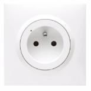

#######
Danfoss
#######

********************
Ally: Tete Radiateur
********************

Premiere mise sous tension
--------------------------

* Mettre la zigate en mode inclusion
* Enlever le couvercle d'Ally en tirant et en appuyant sur le clips situé en dessous
* Retirer la bande papier qui protège les piles
* Un appui court sur le bouton proche écran
* L'inclusion doit se faire et vous devez voir Ally dans la liste des équipements

inclusion
---------

Fonctions
---------

Fonctionne:
 * On
 * Off
 * Toggle
 * Lecture etat On/Off
 * Retour état automatique On/Off (Bind On/Off, Report On/Off).

  * Sur appui bouton poussoir du boitier l'etat remonte. Le bouton provoque un toggle ( <= Bouton Poussoir).
  * Sur changement etat commandé depuis la ZiGate, il ne rapporte pas son état ! Heureusement Abeille demande !!!

 * Groupe
 * Scene (Devrait être ok d apres retour utilisateur)
 * Routeur (elle diffuse les Link Status)

Pas supporté:
 * Level (C'est normal le module contient un relai et ne contient pas le cluster level).
 * Puissance (Pas dans le module)
 * Consommation (Pas dans le module)

En cours d investigation:

.. a noter:: Cependant, il y a un point à soulever. Une fois en position ON, l’application remonte une consommation de 50W … pourtant, côté sniffer, aucune trame ZigBee ne remonte cette information… alors je ne sais vraiment pas d’où ils sortent cette donnée.

.. a noter:: Pour les 50W de consommation de la lampe dans l aplpli Legrand, c’est dans les parametres, pas de mesure, juste une valeur (estimée) a rentrer, par defaut 50W.
