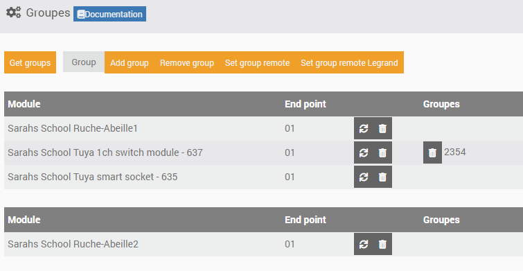
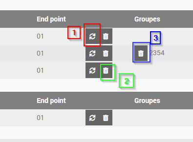

Groupes
~~~~

Les équipements peuvent être adressés de deux façons:

* Directement via leur adresse Zigbee courte qui leur est attribuée lors de l'inclusion
* Ou via une adresse de "groupe" permettant de joindre un ensembles d'équipements en même temps si ILS SUPPORTENT CETTE FONCTIONALITE

Les adresses de groupe sont typiquement utilisées pas les télécommandes Zigbee: Hue, Ikea,...

L'intérêt est qu'un seul message sera envoyé sur le réseau Zigbee, répété par tous les routeurs et tous les équipements ayant cette adresse de groupe réagiront donnant une impression d'exécution simultanée.

.. note:: Astuce: Ça peut aussi vous sortir d'une situation ou la couverture radio n'est pas bonne et ou vous avez du mal à joindre un équipement. Si vous l'adressez avec son adresse courte, le message doit être routé jusqu'à sa destination par une route spécifique qui peut être interrompu par une muvaise liaison radio. Si vous l'adressez avec une adresse de groupe, le message va être répété par tous les routeurs et vous augmentez la chance que l'équipement reçoive l'information.

Vous pouvez aussi utiliser un scénario dans Jeedom pour adresser un groupe d'équipements, en envoyant à chacun d'eux une commande. Cette solution ne permet pas d'avoir l'impression d'instantanéité mais est très flexible si vous avez un mix de produit zwave et Zigbee par exemple.

Les équipements supportant l'adressage par groupe sont listés dans la section "Groupes"

Raffraichir ou supprimer un/tous les Groupes

Le bouton '1' permet de raffraichir tous les groupes pour l'équipement correspondant.
Le bouton '2' quant à lui permet de supprimer tous les groupes.
Le bouton '3' enfin permet de ne supprimer qu'un seul groupe.
