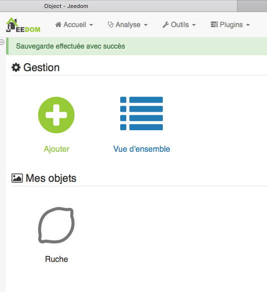

Installation
============

Pre-requis
----------

Avant de vous lancer dans l'installation d'Abeille, vérifiez que vous avez un :doc:`Systeme` qui est dans le cadre de ce developpement.

Une fois l'installation faite, il est nécessaire de vérifier la configuration du plugin et de l'adapter à votre situation, pour se faire il est nécessaire de faire le :doc:`Parametrage` du plugin.

Quand tout est en place, vous allez ajouter des équipements. Afin d'avoir une interface graphique jolie dans Jeedom vous pouvez adapter les :doc:`Widget` qui seront utilisés. C'est optionel. C'est juste pour faire beau.

Installation de la version "stable"
-----------------------------------

L'installation standard du plugin se fait directement depuis le market (Plugins > Gestion des plugins > Market)

.. image:: images/InstallationMarket-1.png

Dans la partie "Rechercher" entrez "Abeille"

.. image:: images/InstallationMarket-2.png

Et enfin lancez l'installation via le bouton "Installer stable"

.. image:: images/InstallationMarket-3.png

Une fois installé passez à l'activation du plugin.

Installation de la version "beta"
---------------------------------

L'installation de cette version "non stable" n'est pas recommandée. Elle ne devrait être faite qu'en accord avec les developpeurs pour par exemple vérifier un correctif en avance de phase.

La procédure est la même que ci dessus en cliquant sur "installer beta" mais si ce dernier bouton n'est pas disponible, il vous faut vous connecter sur le market Jeedom, puis activer cette possibilité via votre "profil".

.. image:: images/InstallationMarketBeta-1.png

et

La suite est identique à l'installation d'une version 'stable' mais en selectionnant 'Installer beta'.

Activation du plugin
--------------------

Cette étape est indépendante de la méthode d'installation du plugin (market, GitHub, direct Git repo) .
Via la page de configuration du plugin, la première chose à faire est l'activer comme suit:

.. image:: images/Installation-1.png

Lancer l'installation des dépendances

.. image:: images/Installation-2.png

Enfin activer la gestion automatique des démons et les lancer.

.. image:: images/Installation-3.png

Configuration d'une ou plusieurs zigates
----------

'Abeille' supporte est dédié à la passerelle "Zigate" sous toutes ses formes (USB, Wifi, PIN ou DIN).
Via la page de configuration il faut indiquer à Abeille comment acceder à la zigate.

Etendre la zone "Zigates"

.. image:: images/ConfigurationZigate-1.png

Et configurez le port d'accès à la zigate.

- Indiquez son type
- Si type USB, PI ou DIN, indiquez sur quel port serie Abeille pourra communiquer avec la zigate. Si du type Wifi, il faudra remplir l'adresse IP.
- Testez la communication. Le status OK, avec la version de firmware, devrait apparaitre en 4. Cette partie ne supporte pas le type Wifi actuellement.
- Activez la zigate.
- Sauvegardez. Ne pas oublier cette étape.

.. image:: images/ConfigurationZigate-2.png

Information complémentaires PiZigate: :doc:`InstallationPiZiGate`.

Mise a jour du plugin
----------

Market
~~~~~~

Mise à jour à partir du market
Rien de particulier, suivre la méthode de base de Jeedom

Github
~~~~~~

Mise à jour à partir de github

.. code-block:: php
   :linenos:

   cd /var/www/html/plugins/Abeille
   sudo git pull https://github.com/KiwiHC16/Abeille

Installation avancée
--------------------

L'installation par défaut passe par le "market" Jeedom. C'est le mode le plus simple. Néanmoins pour des besoins d'accès à une version de developpement par exemple il peut être nécessaire d'installer le plugin par un autre biais.

Via Jeedom à partir de GitHub
~~~~~~~~~~~~~~~~~~~~~~~~~~~~~

Commencer par autoriser l'accès à GitHub via la config Jeedom.

* Réglages-> Système -> Configuration
* Selectionner l'onglet "Mise à jour/market", puis "GitHub" dans la partie "Configuration des dépots"
* Activez GitHub
* et "Sauvegarder".
   .. image:: images/InstallationAvancee-3.png

A partir de la il est possible d'installer n'importe quel plugin à partir de "GitHub".

* Aller sur "Plugins" puis "Gestion des plugins".
* Pour ajouter un plugin depuis GitHub et non pas du market, cliquer sur "Plugins (+)"
   .. image:: images/InstallationAvancee-1.png

* Dans "Type de source", sélectionner Github puis entrez les informations suivantes
   * ID logique du plugin: Abeille
   * Utilisateur ou organisateur: KiwiHC16
   * Nom du dépôt: Abeille
   * Branche: master (ou le nom de la branche depuis laquelle vous devez recupérer le plugin, ex: beta)
   * Cliquer sur Enregistrer.
   .. image:: images/InstallationAvancee-2.png

Via SSH et un fichier Zip
~~~~~~~~~~~~~~~~~~~~~~~~~
.. code-block:: php
   :linenos:

   cd /var/www/html/plugins/
   mkdir Abeille
   cd Abeille
   unzip le fichier téléchargé de GitHub dans le répertoire
   cd ..

Puis appliquer les bons droits :

.. code-block:: php
   :linenos:

   chmod -R 777 /var/www/html/plugins/Abeille
   chown -R www-data:www-data /var/www/html/plugins/Abeille

Via Git
~~~~~~
Directement avec git (Le plus simple et le plus rapide)

.. code-block:: php
   :linenos:

   cd /var/www/html/plugins/
   git clone https://github.com/KiwiHC16/Abeille.git Abeille

Puis appliquer les bons droits :

.. code-block:: php
   :linenos:

   chmod -R 777 /var/www/html/plugins/Abeille
   chown -R www-data:www-data /var/www/html/plugins/Abeille

Ancienne doc
------------

Etape 1: Zigate
~~~~~~~~~~

La Zigate peut être connectée au port USB, par module Wifi ou sur le port GPIO d'un Raspberry Pi.

Pour les utilisateurs très avertis, il existe des :doc:`Solutions` plus complexes qui amène de la flexibilité que j'utilise personaellement.

Pour la PiZiGate, des étapes spécifiques sont nécessaires, :doc:`InstallationPiZiGate`.

Le firmware supporté est le dernier publié avec un petit décalage le temps d'adapter Abeille dans cet entretemps c'est l'avant derniere version qui est supportée. Pour mettre a jour le :doc:`InstallationFirmware`.

Etape 2: Widget
~~~~~~~~~~

L'installation de Widget est une option permettant d'avoir un visuel plus joli.

.. attention::

    Sur les dernières versions de Jeedom, il y a des problèmes de rafraichissement de widget.

Vous pouvez installer quelques widgets (officiels) pour que le rendu soit plus sympa

* baromètre pour le capteur Xiaomi Carré (dashboard.info.numeric.barometre )
* thermomètre pour les capteurs Xiaomi ronds et carrés (dashboard.info.numeric.tempIMG)
* humidité pour les capteurs Xiaomi ronds et carrés (dashboard.info.numeric.hydro3IMG)

Etape 3: Référence
~~~~~~~~~~

Créer un objet Jeedom pour retrouver rapidement et facilement les nouveaux équipements.

Tous les nouveaux équipements seront attachés à cet objet.

Bidouilles
~~~~~~~~~~

Pour écraser des "bidouilles" locales :

.. code-block:: php
   :linenos:

   cd /var/www/html/plugins/Abeille
   sudo git reset --hard HEAD
   sudo git pull https://github.com/KiwiHC16/Abeille
