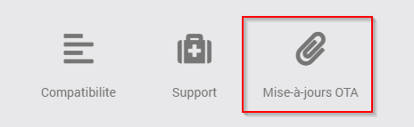
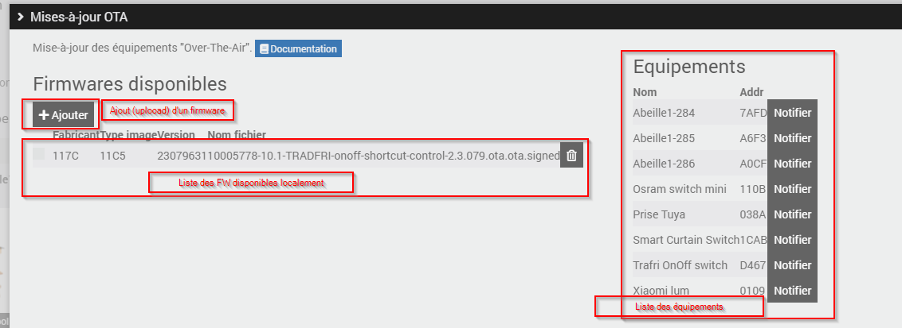

Mise-à-jour "Over The Air"
-------------------------

Certains équipements supportent la mise-à-jour de leur firmware à travers le réseau (Over The Air).

Abeille permet d'effectuer cette mise-à-jour dés lors que vous avez récupéré le bon firmware auprès du fabricant.

Accès à l'assistant de mise-à-jour
~~~~~~~~~~~~~~~~~~~~~~~~~~~~~~~~~~

Via la page des équipements (Plugins > Protocole domotique > Abeille)

En cliquant sur le bouton ci-dessus, l'assistant de mise-à-jour apparait comme l'exemple suivant:

Le bouton AJOUTER permet de charger un firmware sur la boxe Zigbee.

Les formats supportés sont ".ota" ou ".ota.signed".

A partir du moment ou un firmware est disponible, vous pouvez notifier l'équipement correspondant pour lui demander de lancer la mise-à-jour. N'oubliez pas que si cet équipement est sur batteries, il faut le reveiller tout de suite apres l'applui sur le bouton "NOTIFIER.

Un peu de détail
~~~~~~~~~~~~~~~~

Pour les curieux, le sequencement des étapes de mise-à-jour est le suivant:

- Optionnel: L'équipement peut être 'notifié' qu'un firmware est disponible pour lui
- L'équipement demande si un FW est disponible
- La zigate répond oui "il y en a un, telle version", ou "non"
- L'équipement demande l'envoi du firmware par petits "blocks"
- Le plugin renvoi les bouts de demandés. Cette étape peut prendre un long moment (autour d'1H pour un firmware Ikea par ex)
- Une fois le transfert terminé, l'équipement vérifie l'integrité et fait sa mise à jour si tout est monde ou remonte une erreur