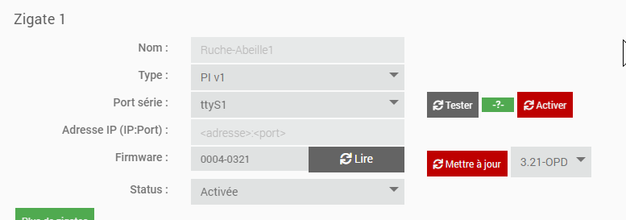
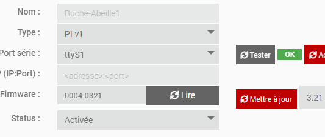
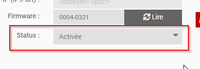
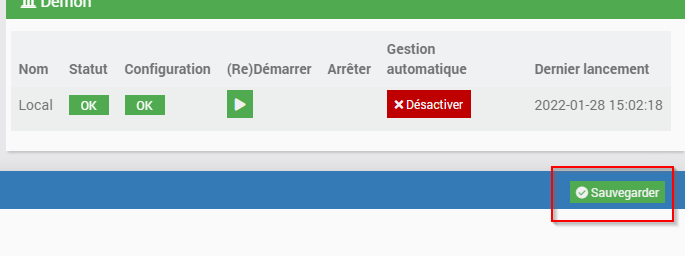
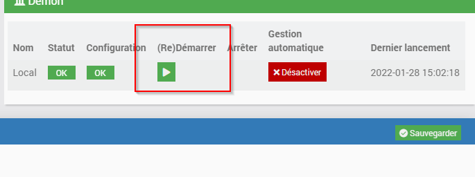

La page de configuration d'Abeille
-----------

Dépendances
~~~~~~~~~~

2 éléments sont potentiellement requis en fonction du type de zigate que vous utilisez:

- le package WiringPI est requis si une des zigates est du type "PI"
- le package 'socat' est requis si une des zigates du type "WIFI"

.. image:: images/ConfigPage-Dependencies.png

Configuration de la zigate
~~~~~~~~~~

L'exemple ci apres montre la configuration d'une zigate du type "PI", connectée sur le port "ttyS1" et activée.

Les éléments a remplir sont les suivants

- Le type de zigate: "PI", "USB", "DIN" ou "WIFI" et la version correspondante
- Si type USB/PI ou DIN, le port utilisé
- Si type WIFI, l'adresse IP et le port de la zigate

Une fois ces éléments connus, il est possible de faire un test de communication (sauf version WIFI pour l'instant) via le bouton "Tester".
Si le test est bon, "OK" en vert apparaitra. Sinon le log "AbeilleConfig.log" doit donner + de précisions quant au problème rencontré.

Une fois le test OK, il ne vous reste qu'a activer la zigate, sauvegarder, et redémarrer Abeille

puis

et enfin

