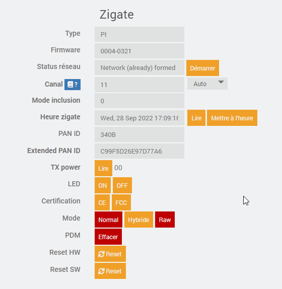
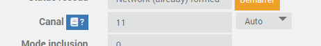

Mode 'Avancé' pour une Zigate
~~~~~~~~~~~~~~~~~~~~~
En cliquant sur une Zigate, puis sur l'onglet 'Avancé', le menu suivant est affiché:

Choix du canal ZigBee

Par défaut le canal est choisi par la Zigate elle-même en fonction de l'occupation des fréquences (mode "auto").

Le canal choisi est affiché et il est possible de "forcer" un canal de son choix.

