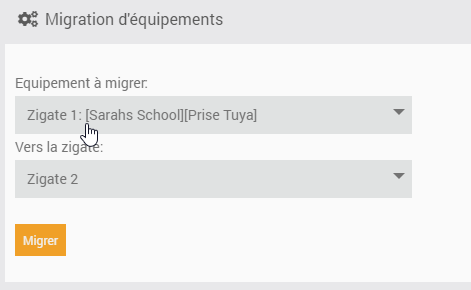

La page de gestion des équipements
-----------------------
On accède à cette page via différents moyens:

- Le menu Plugins > Protocole domotique > Abeille
- Depuis la page de config via le bouton 'Ouvrir' de la zone 'Etat'

Cette page liste tous les équipements gérés par Abeille et déja inclus dans Jeedom.

.. include:: Groups.rst

Migration d'équipements
~~~~~~~~~~~~~~~~~~

Si vous avez plusieurs Zigates et souhaitez basculer un équipement de l'une à l'autre, c'est le chapitre qu'il vous faut.

Globalement dans tout réseau Zigbee, la procédure est

- d'exclure proprement l'équipement de son réseau initial
- puis de le réintégrer dans le nouveau réseau

dans les 2 cas, lors de l'inclusion dans le nouveau réseau, Abeille devrait reconnaitre l'équipement (graçe à son adresse IEEE) et faire la mise à jour nécessaire pour qu'il n'y ai aucun doublon.

Dans la pratique, la partie suivante est une aide à cette migration bien qu'elle puisse ne pas fonctionner dans tous les cas. En particulier les équipements plus vieux que Zigbee 3.0 peuvent être 'capricieux'.

Une fois l'équipement et la zigate de destination choisis, la séquence sera la suivante

- La Zigate destination passe en mode 'inclusion'.
- Demande à l'équipement de quitter le réseau.

  Si l'équipement est sur **piles**, vous devez le **reveiller** dans la foulée. C'est probablement le + compliqué.
  Une fois sorti du réseau, il devrait se remettre à la recherche d'un nouvau réseau avec qui s'associer.

Dans tous les cas si cette procédure ne fonctionne pas, le plus simple revient à

- Mettre la Zigate destination en mode inclusion.
- Puis forcer un reset sur l'équipement pour qu'il fasse une nouvelle association.
