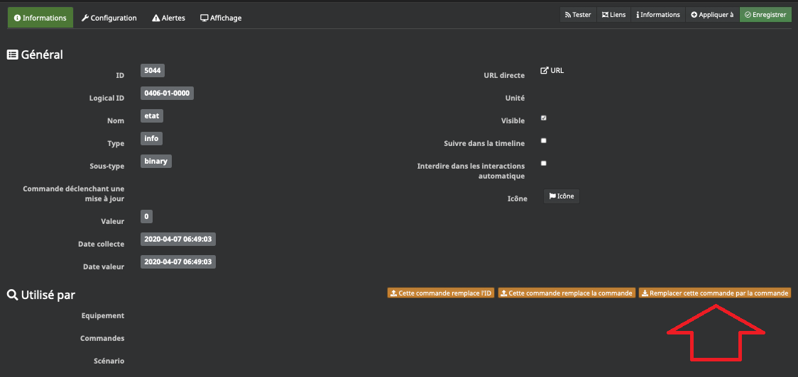
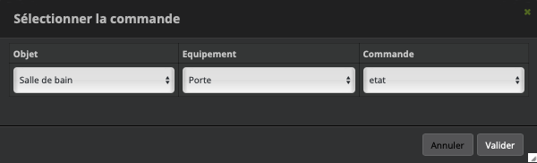
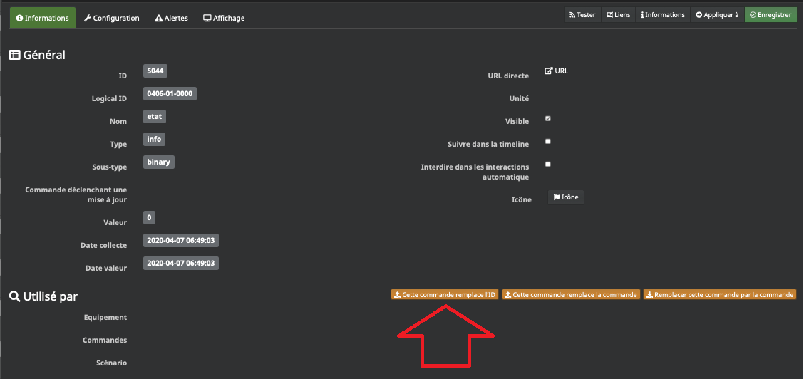
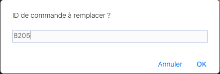
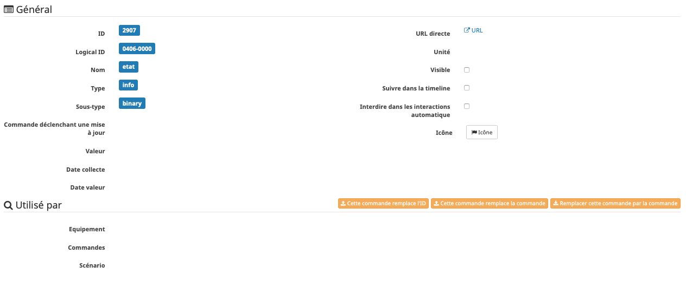
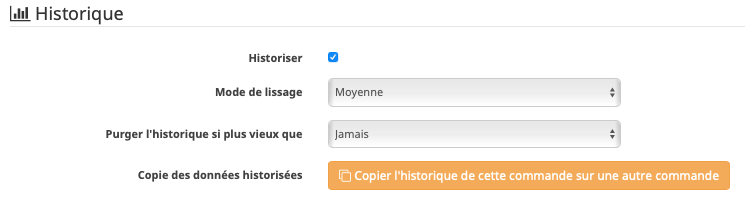

################
Fonctions Jeedom
################

*************
objet fantôme
*************

"Equipements fantomes (sans adresse IEEE).

Lors de l’inclusion d’un nouvel équipement, Abeille va devoir le référencer dans Jeedom pour qu'il ait une représentation graphique et qu'on puisse interagir avec lui.

Adresses courte et IEEE

Le réseau Zigbee permet d’adresser les équipements par l’intermédiaire d’une adresse courte.

Celle-ci est affectée à l’équipement par le coordinateur (la zigate) lors de l’inclusion (appairage).

Pour ceux qui connaissent le monde IP, c’est comparable au protocole DHCP.

Cette adresse courte peut changer au cours du temps par exemple lorsqu’un équipement quitte le réseau, son adresse courte peut être réaffectée à un nouvel entrant.

Il n'est donc pas fiable dans le temps d’identifier un équipement particulier à partir de son adresse courte.

Heureusement, les équipements ont tous une adresse IEEE, unique au monde. Deux équipements ne peuvent donc pas avoir la même et ceci même s'il s'agit de deux produits identiques. C’est un peu comme le numéro de sécurité sociale.

A partir de cette adresse on peut identifier l’équipement de façon certaine. Mais elle ne nous informe pas sur le type d’équipement.

Récupération d'informations complémentaires

En dehors de son adresse, il est nécessaire de connaitre le type d'équipement dont il s'agit. Il est obtenu en lui demandant son nom (une chaine de caractères).

Comme Abeille cherche a être le plus générique possible, des qu’une information interessante remonte de la zigate un équipement est créé.
En gros des qu’on arrive à avoir le nom et l’adresse courte de l’équipement physique alors on crée un équipement dans Jeedom.
Ensuite Abeille cherche a collecter le plus d’infos possible sur l’équipement en l'interrogeant. En particulier récupérer l’adresse IEEE pour l'identifier de façon unique.

Equipements "fantomes" (adresse IEEE manquante)

Mais l'inclusion ne se passe pas forcement toujours très bien.

Par exemple

l’équipement se joint au réseau Zigbee

la Zigate lui affecte une adresse courte

Abeille récupère son nom et son adresse courte et crée un équipement A dans Jeedom.

Abeille cherche alors a récupérer l’adresse IEEE auprès de l équipement physique mais pour une raison X ou Y, Abeille n’y parvient pas.

L’équipement quitte le réseau puis le rejoint à nouveau. Une nouvelle adresse courte lui est affecté (B, different de A)

Abeille reçoit le nom avec la nouvelle adresse B et crée un deuxième équipement dans Jeedom. Le résultat est que l'équipement A dans Jeedom ne représente rien de concret.

Il y a d’autres scénarii qui peuvent provoquer la création d’équipement dans Jeedom sans lien avec un équipement physique.

Pour limiter ces creations de "fantomes" il est important de récupérer les adresses IEEE. Car a la creation si l’adresse IEEE est connue, Abeille pourra mettre à jour la base Jeedom au lieu de créer un nouvel equipement.

Pour connaître les équipements fantomes dans Abeille, il faut aller dans la page santé et investiguer les équipements en timeout et sans adresse IEEE. Une fois que vous pensez que c est un équipement fantôme, essayez de la faire réagir depuis abeille (par exemple Allume/Eteint pour une ampoule), ou en le faisant réagir physiquement (par exemple en ouvrant une porte). Si rien ne se passe il fort probable que cela soit un fantôme que vous pouvez supprimer de Jeedom.

Dans les dernières versions d’abeille (depuis fin février 2020), j’ai ajouté une fonction essayant de récupérer les IEEE des équipements. Normalement au bout d’une heure l’information IEEE est récupérée et le processus s’arrête. Dans le cas d’un fantôme, l’interrogation est envoyée mais l’information n’est pas récupérée, pour l instant l’interrogation continue indéfiniment. Il faut que je trouve un moyen pour mieux gérer ces cas. Le problème est que les fantômes provoquent ces interrogations sans fin en chargeant la zigate.

Si dans la page santé vous trouvez un fantôme, supprimez le.

Si vous trouvez des équipements sans adresse IEEE, réveillez les plusieurs fois pour qu’ils répondent et que l’adresse IEEE apparaisse dans la page santé (la rafraichir en la fermant puis ouvrant).

Gestion
=======

si à un objet fantôme est associé un scénario, une commande... il est possible de les basculer simplement vers l'objet actif sans éplucher l'ensemble des programmes faits:
-Sur l'objet fantôme, aller sur la commande souhaitée (par exemple: Etat, On, Off...) et éditer cette commande (roue crantée à coté de 'Tester')

.. image:: images/78655620-8fd24000-78c6-11ea-9984-0e2cb3366360.png

-Cliquer sur le bouton 'Remplacer cette commande par la commande':

-Aller chercher la commande sur l'objet actif:

-Dans l'onglet Configuration, vérifier qu'il n'y a pas eu de commandes de créé dans la rubrique 'Action sur valeur' (pour les commandes d'infos) ou 'Action avant/après exécution de la commande' (pour les commandes d'actions). Si des champs ont été renseigné, il faut les reporter sur l'objet actif. De plus, pour les commandes historisées, il est possible de transférer cet historique par le bouton 'Copier l'historique de cette commande sur une autre commande':

.. image:: images/78772907-be1d5180-7992-11ea-8cd3-e4e6a139d984.png

Il est possible alors de supprimer, sans pertes, l'objet fantôme.
Depuis Jeedom 4.0, la demande de confirmation de suppression d'objet indique les interactions encore actives avec ce dernier. Ainsi, s'il y a autre chose que l'objet parant, c'est qu'un transfert de commande est encore à réaliser (dans l'exemple ci-dessous, l'objet est encore déclaré dans le scénario test):

.. image:: images/78654274-995aa880-78c4-11ea-8ef9-ee8cdb0b9a9f.png

Une fois l'objet supprimé, il est possible de vérifier que cela n'a pas générer de commandes orphelines (Analyse -> Équipements -> Commandes orphelines):

.. image:: images/78654559-fa827c00-78c4-11ea-9c4b-86878747e687.png

Ici, on voit que la commande #8205# a été supprimée alors qu'elle est mentionnée dans le scénario test. Si tel est le cas, il faut dans un premier temps identifier à quoi faisait référence cet objet (une commande d'état par exemple), puis aller sur la commande remplaçant l'ancienne commande fantôme, et cliquer sur 'Cette commande remplace l'ID'

Puis remettre le numéro de la commande orpheline:

Normalement avec tout ça, ma migration devrait se refaire facilement et sans loupés ;)

************
Remplacement
************

Commande
========

Vous pouvez remplacer une commande A par une autre commande B à l'aide des boutons oranges:

Cela permet de mettre à jour les scénarios, les autres objets,... faisant référence à cette commande. C'est très pratique et rapide.

Mais car il y a un mais, ou plutôt n'oubliez pas qu'une commande est attachée à un objet, un historique et éventuellement un autre Jeedom par JeeLink. A vous de gérer ces aspects.

Si vous aviez une mesure de température A que vous avez remplacé par une mesure B et que vous voulez aussi transférer l'historique de A vers B:

