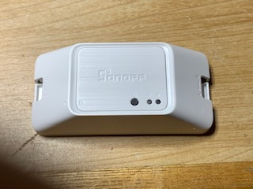
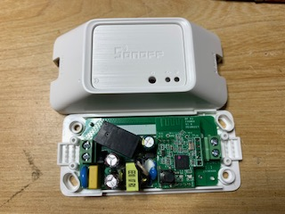
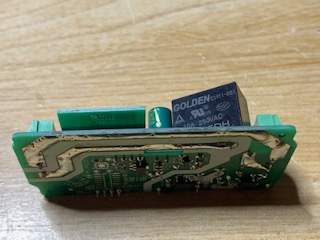
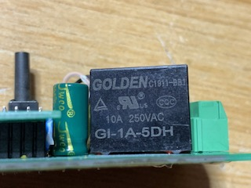
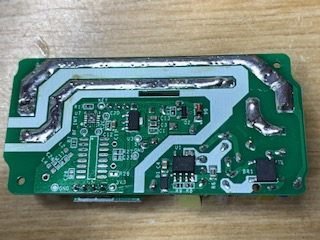
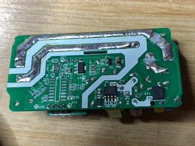
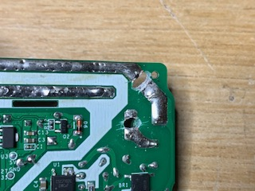
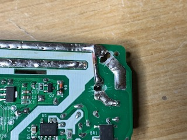

######
SonOff
######

SonOff SNZB-01: Interrupteur
----------------------------

https://github.com/KiwiHC16/Abeille/issues/1322

Fonctionenment
^^^^^^^^^^^^^^

Appui court: Toggle (Valeur 2)

Double clic: On (Valeur 1)

Clic long (4s): Off (Valeur 0)

Valeur dans la commande Click-Middle si inter bind sur la zigate.

Inclusion
^^^^^^^^^

- mettre la zigate en Inclusion
- Avec trombone, 10s sur inter au dos

Exclusion
^^^^^^^^^

- La zigate ne doit pas être en mode Inclusion
- Avec trombone, 10s sur inter au dos

Reveil
^^^^^^

- Si le module n'a jamais été configuré, il faut faire une inclusion car il reste reveillé quelques secondes après inclusion.
- Si le module est déjà configuré alors  un appui sur le bouton le reveille (J ai eu un cas ou il ne faisait pas de Data Request alors on ne peut pas lui parler, j ai du le re-inclure).

Configurer
^^^^^^^^^^

- Faire un bind vers l'équipement à piloter. Il fait ensuite On/Off/Toggle sur l'adresse de l'équipement.

SonOff SNZB-02: Temperature / Humidité
--------------------------------------

https://github.com/KiwiHC16/Abeille/issues/1323

Fonctionenment
^^^^^^^^^^^^^^

Inclusion
^^^^^^^^^

- Zigate en inclusion
- Appui long >10s sur bouton lateral

Exclusion
^^^^^^^^^

- Zigate pas en mode inclusion
- Appui long >10s sur bouton lateral

Reveil
^^^^^^

- Je ne parviens pas à le réveiller à l'aide du bouton lateral.
- Si pas configuré, l'inclure et le configurer immédiatement
- Une fois configuré, faire changer la temperature ou humidité (le mettre dans ses mains, souffler dans l ouverture) et il doit se reveiller.

Recuperation
^^^^^^^^^^^^

Si par erreur il a ete supprimé de jeedom, avec le plugin en mode "Blocage des annonce: non, blocage des recuperations: non", sur un changement de temperature il doit être re-créé dans Abeille.

Configurer
^^^^^^^^^^

- bind/setreport sur temperature et humidite
- bind sur Power

SonOff SNZB-03: Capteur IR
--------------------------

https://github.com/KiwiHC16/Abeille/issues/1324

Fonctionenment
^^^^^^^^^^^^^^

Inclusion
^^^^^^^^^

Exclusion
^^^^^^^^^

Reveil
^^^^^^

Configurer
^^^^^^^^^^

SonOff SNZB-04: Capteur de porte
--------------------------------

https://github.com/KiwiHC16/Abeille/issues/1325

Fonctionenment
^^^^^^^^^^^^^^

Inclusion
^^^^^^^^^

Exclusion
^^^^^^^^^

Reveil
^^^^^^

Configurer
^^^^^^^^^^

SonOff BASICZBR3: Module 10A
----------------------------

Comme je ne trouvais pas de relai piloté par zigbee j'ai fait ma propre bidouille. Comme d'habitude comme c'est sur le 220V, je ne suis pas responsable de vos actes. Vous faites ces manipulations que si vous savez ce que vous faites. Je ne pourrai être tenu responsable.

Vue d'ensemble du boitié:

Il faut ouvrir la bête, le relai est le boitier noir vers le haut de la photo: 

On peut voir les pistes épaisses sous le dessous, allant sur les pattes du relai:

Le relai lui même en 10A:

Les deux grosses pistes qu'il va falloir couper:

Au cuteur, découpe des deux pistes:

Mais en faite cela ne suffit pas il faut prendre la perceuse et passer au travers completement:

Souder un bout de cuivre entre la patte du relai et la piste extérieure:

Et le tour est joué.

Note: lors du retablissement du courant, suite à une coupure de secteur par exemple, le module se souvient de son état initial et reposition le relai dans cet état.   
