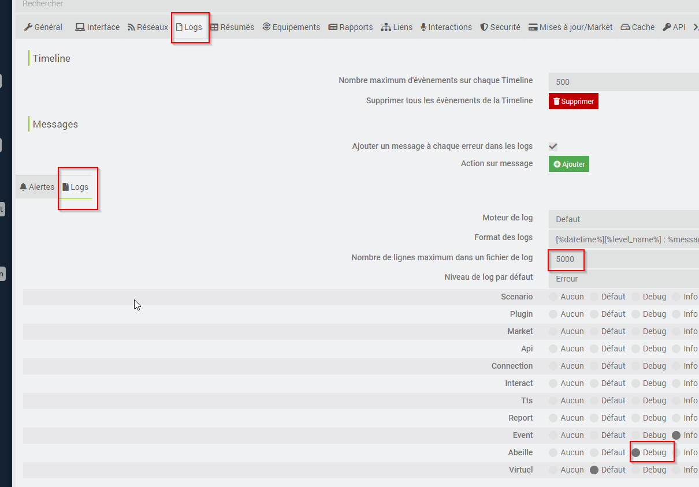

# Support

Si vous avez des questions, rencontrez des problèmes, ou demandez le support d'un nouvel équipement, c'est le chapitre qu'il vous faut.

**Pour toute demande de support, merci avant tout**

- d'être sur d'être en **'mode debug'** (voir ci-dessous)
- d'avoir modifié le nombre de lignes de log de 500 à 5000 via la configuration Jeedom (voir ci-dessous)
  Pensez à **redémarrer** Abeille après ce genre de changement.

## Activer le mode 'debug'

Cette action se fait via la page de configuration du plugin 'Abeille'.

Après changement, penser à (dans l'ordre)

- à sauver (bouton 'Sauvegarder')
- **ET** redémarrer les démons Abeille

## Configuration jeedom pour les logs

Pour toute livraison de logs pour besoins de support, il est recommandé de

- Passer le nombre de lignes à AU MOINS 5000 par log (500 par défaut = trop court).

  - Reglages > Systeme > Configuration > Logs
  - puis encore 'Logs'

    

  - "Nombre de lignes maximum dans un fichier de log" >= 5000
  - Sauvegarder
  - Relancer Abeille

- Faire un drag & drop du package fourni par la page support/télécharger tout.

## Forum

- Liste des sujets en cours de discussions: `Forum Jeedom <https://community.jeedom.com/tag/plugin-abeille>`\_

- Liste des sujets en cours d'investigations: `GitHub Abeille <https://github.com/KiwiHC16/Abeille/issues?utf8=✓&q=is%3Aissue>`\_

## Accès à la base de données Jeedom

Acceder à la database Jeedom qui stocke les équipement ou commandes peut être utile pour le debug.

L'accès se fait via le menu "Réglages", puis "Système" et "Configuration".

.. image:: images/MenuReglagesSystemeConfig.png

puis "\_OS/DB" et enfin "Administration Base de données"

.. image:: images/BoutonAdminBD.png

Affichage des commandes

.. image:: images/Db-SelectCmd.png

.. include:: debug/Monitor.rst

## Signaler un bug

En cas de soucis ou questions n'ayant pas trouvé réponse dans le forum, vous pouvez ici <https://github.com/KiwiHC16/Abeille/issues>

- soit compléter un sujet existant correspondant à votre souci
- soit réouvrir un sujet déja clos si le problème existe toujours
- ou enfin créer un nouveau sujet.

Si vous ouvrez une "issue" merci de fournir le plus d'information possible et en particulier:

Votre configuration Jeedom:

- Le HW sur lequel vous faite tourner le plugin,
- la Version de l'OS,
- la version de Jeedom
- ...

Votre configuration Gateway

- Type de Zigate
- quel firmware
- ...

Les logs, aussi nombreux que possibles surtout

- AbeilleParser
- AbeilleMQTT
- Abeille
- ...

Description

- ce que vous cherchez à faire
- les résultats
- captures d'ecrans
- ...

## Demander une amélioration

Si vous souhaitez une évolution dans le plugin, merci d ouvrir une "issue" dans GitHub à l'adresse avec un "Labels" "enhancement": https://github.com/KiwiHC16/Abeille/issues
