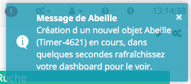

#####
Timer
#####

.. image:: images/node_Timer.png

************
Introduction
************

plugin TIMER qui fonctionne à la seconde.

Fonctionnement
==============

.. image:: images/Capture_d_ecran_2018_03_21_a_13_16_53.png

Le timer possède 4 phases:

T0->T1: RampUp de 0 à 100% => RampUp

T1->T2: Stable à 100% => duration (Seconde)

T2->T3: Ramp Down de 100% à 0% => RampDown

T3-> : n existe plus

Exemple d'application: allumage progressif d une ampoule, maintient allumé pendant x secondes puis extinction progressive.

[NOTE]
Il est important de noter que chaque phase fait au minimum 1s.

[NOTE]
Le rafraichissement du widget se fait toutes les 5s mais la mise à jour des valeurs se fait toutes les secondes.

Commandes
=========

Dans les premières versions du timer, il fallait configurer directement dans les Commandes les parametres. Maintenant cela se fait dans la page Param.

[NOTE]
Certaines captures d'écran datent de cette période, ne pas modifier les commandes comme pourrait le faire croire les images mais bien faire le parametrage dans la page Param.

*****
Video
*****

`Video expliquant les fonctionnements des Timers.  <https://youtu.be/B3qullXc-_s>`_

Trois commandes
===============

* Start: permet d'exécuter une commande et de démarrer le Timer.
* Cancel: permet d'exécuter une commande et d'annuler le Timer.
* Stop: permet d'exécuter une commande, à l'expiration du Timer.

Retour d'information
====================

* Time-Time: Date de la dernière action sur le Timer
* Time-TimeStamp: Heure système de la dernière action
* Duration: Temps restant avant expiration du Timer en secondes
* ExpiryTime: Heure d'expiration du Timer
* RampUpDown: Pourcentage entre 0 et 100 (Ramp Up 0->100, Ramp Down 100->0)

Elles ne sont pas forcement toutes visibles, à vous de choisir.

Dans les phase de ramp Up ou Down, la commande actionRamp/scenarioRamp est exécutée régulièrement avec pour paramètre la valeur en cours de RampUpDown.

Creation d un Timers
====================

Pour créer un objet Timer, clic sur le bouton "Timer" dans la configuration du plugin.

Un message doit apparaitre pour annoncer la création du Timer avec un Id Abeille-NombreAléatoire.

Apres avoir rafraichi l'écran vous devriez avoir l objet:

.. image:: images/Capture_d_ecran_2018_03_21_a_13_16_53.png

Configuration du Timer
======================

Equipement
----------

Comme pour tous les objets, dans l'onglet Équipement, vous pouvez changer son nom, le rattacher à un objet Parent, etc...

Param
-----

Dans l'onglet paramétrage du Timer, remplissez les champs:

* Duration: c'est la durée en secondes entre T1 et T2, soit entre la fin du ramp up et le début du ramp down.
* Ramp Up duration: temps en secondes pour passer de T0 à T1
* Ramp Down duration: temps en secondes pour passer de T2 à T3
* action sur demarrage: Action a éxecuter au démarrage du Timer
* "Trigger Action sur demarrage": vous pouvez declencher l action sur changement d'une valeur d une commande info. Definir la commande info qui sert de timer.
* Trigger Test Start: la formule est utilisée pour définir si l ation doit être lancé. Si l evalution du test est vrai alors la comande sera executée. Par exemple: #valueTrigger# == 4. La valeur de la commande qui a trigger l evenement sera comparé à la valeur 4.
* Action sur arret: arret executée lors de l'expiration du timer.
* "Trigger Action sur Stop: idem description start
* Trigger Test Stop: idem description start
* Action sur annulation: action excutée si le timer est annulé
* "Trigger Action sur Cancel: idem description start
* Trigger Test Cancel: idem description start
* Ramp Action: action qui sera executer lors de la variation de la commande info RampUpDown.
[NOTE]
Toutes les commandes sont au format \#[objet][equipement][cmd]# par exemple \#[test][Ruban][Level]#

[NOTE]
la possibilié d'utiliser le fonctionnement avec des trigger demande de rajouter une ligne de code dans le core du code Jeedom.
Dans le fichier /var/www/html/core/class/cmd.class.php, en ligne 1497 ajouter la ligne:
cmd->execute(array('cmdIdUpdated'=>$this->getId()));

Ca donne
if (!$repeat) {
			$this->setCache(array('value' => $value, 'valueDate' => $this->getValueDate()));
			scenario::check($this);
			$level = $this->checkAlertLevel($value);
			$events[] = array('cmd_id' => $this->getId(), 'value' => $value, 'display_value' => $display_value, 'valueDate' => $this->getValueDate(), 'collectDate' => $this->getCollectDate(), 'alertLevel' => $level);
			$foundInfo = false;
			$value_cmd = self::byValue($this->getId(), null, true);
			if (is_array($value_cmd) && count($value_cmd) > 0) {
				foreach ($value_cmd as $cmd) {
					if ($cmd->getType() == 'action') {
						$events[] = array('cmd_id' => $cmd->getId(), 'value' => $value, 'display_value' => $display_value, 'valueDate' => $this->getValueDate(), 'collectDate' => $this->getCollectDate());
                        $cmd->execute(array('cmdIdUpdated'=>$this->getId()));
					} else {

Commande ou Scénario
====================

Par défaut l'objet Timer est créé avec des commande Start, Stop, Cancel qui font référence à l'exécution d'une commande.

Mais vous avez la possibilité d'appeler un scénario à la place d'une commande.

Cela vous permet beaucoup plus de flexibilité comme le lancement d'une série de commandes.

L'Id du scénario est dans le tab de la page de configuration du scenario.

.. image:: images/Capture_d_ecran_2018_03_27_a_12_55_27.png

Ici vous pouvez voir l'ID 3 du scénario utilisé.

Exemple:

Trop fort : il suffit de chainer les timers !!! => Timer 2 se declenche sur arret du timer 1.

* timer 1 pour lumière pendant 4h sur ouverture de porte
* fermeture de porte au bout de x minutes qui provoque le stop du timer 1
* timer 1 passe a zero et declenche le timer 2 start qui reste allumé pour 5 minutes
