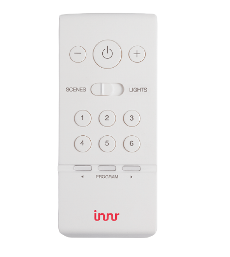

# Télécommande RC110

Cette page est basée sur les tests de la RC110 v2 dont le look est le suivant:

## Procédure de reset

Bouton PROGRAM + bouton MARCHE/ARRET pendant qq secs jusqu'a clignotement.

## Procédure d'inclusion

## Utilisation avec Abeille

